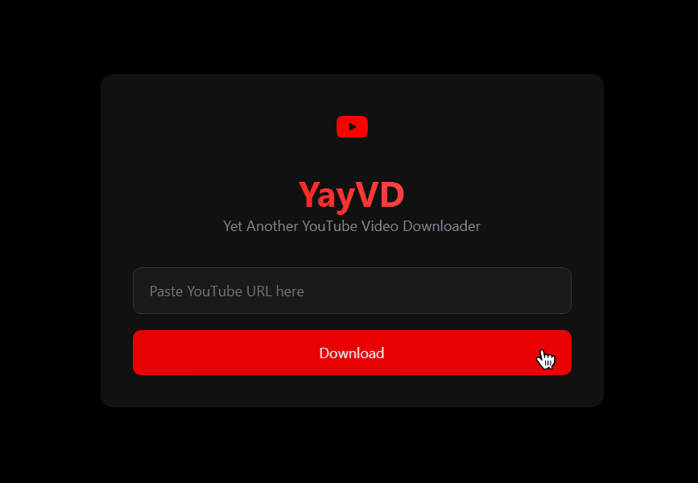

# YayVD
### Yet Another YouTube Video Downloader

A minimal, modern web interface for downloading YouTube videos built with Flask and yt-dlp. Features a clean dark mode UI and supports multiple video quality options.



## Features

- 🎨 Clean, minimal dark mode interface
- 📱 Fully responsive design (mobile-friendly)
- 🎥 Multiple video quality options
- ⚡ Fast downloads using yt-dlp
- 🔒 No ads, no tracking, open source
- 📦 Automatic file cleanup
- 🎯 Simple one-click downloads

## Installation

### Prerequisites

- Python 3.7 or higher
- pip (Python package installer)

### Setup

1. Clone the repository:

```bash
git clone https://github.com/yourusername/youtube-downloader.git
```

```bash
cd youtube-downloader
```

2. Install dependencies:

```bash
pip install Flask
```
```bash
pip install yt-dlp
```

3. Run the application:

```bash
python downloader.py
```

4. Open your browser and navigate to:

```
http://127.0.0.1:5000
```
